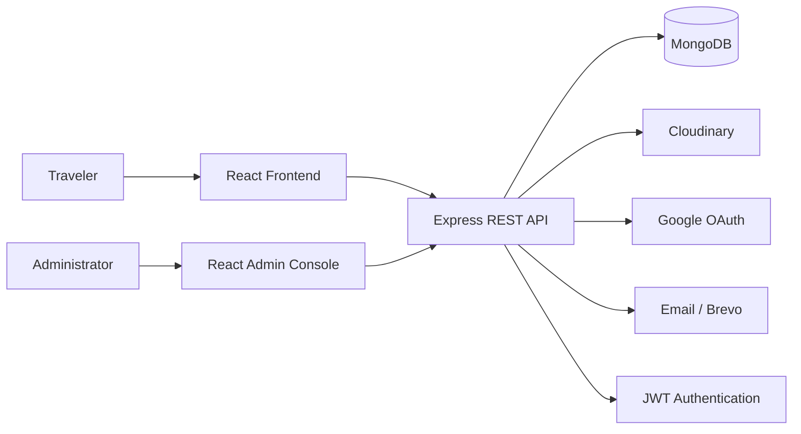

<div align="center">
  

  <h1>Travel Bharat</h1>

  <p><strong>Discover India. Plan Better. Travel Further.</strong></p>

  <p>
    A modern full-stack MERN travel platform for discovering destinations,
    experiences, activities and events across India — supported by a dedicated
    admin console for managing the platform's content and user engagement.
  </p>

  <p>
    <a href="https://travel-bharat-e639.vercel.app/">Live Website</a> ·
    <a href="https://travel-bharata.onrender.com/admin/login">Admin Console</a> ·
    <a href="https://travel-bharat-di74.vercel.app/">API</a>
  </p>

  <p>
    
    
    
    
    
    
  </p>
</div>

---

## 🌏 Overview

**Travel Bharat** is a production-oriented tourism web application built with the MERN stack. It is designed around two connected experiences:

- **Traveler Experience** — a responsive public website for discovering and exploring India's destinations, activities, experiences and events.
- **Admin Console** — a protected content-management interface for administrators to manage destinations, experiences, activities, events, users and social engagement data.

The application follows a separated frontend / admin / backend architecture so each part can be developed and deployed independently while communicating through a centralized REST API.

---

## ✨ Highlights

### Traveler Platform

- 🗺️ Browse Indian destinations by state and location
- 🔎 Search and filter destinations, activities and experiences
- 🧭 Explore travel activities and things to do
- 🎒 Discover curated travel experiences
- 📅 Browse travel events
- 🖼️ Rich destination, activity and experience detail pages
- ❤️ Wishlist support for destinations and travel content
- ⭐ Ratings and reviews
- 💬 Comments and replies
- 👍 Reactions and engagement features
- 👤 User profile management
- 🔐 Login, signup and protected routes
- ✉️ Email verification and OTP-based account flows
- 🔑 Forgot-password and change-password flows
- 🌐 Google authentication support
- 🌓 Light / dark theme support
- 📱 Responsive layouts for desktop and mobile
- ✨ Motion-based UI interactions with Framer Motion

### Admin Console

- 🔐 Protected administrator authentication
- 📊 Dashboard with platform statistics and visualizations
- 🗺️ Destination management
- 🧭 Experience management
- 🏃 Activity management
- 📅 Event management
- 👥 User management
- 💬 Comment management
- ⭐ Rating management
- ❤️ Wishlist management
- 👍 Reaction management
- ➕ Create travel content
- ✏️ Edit travel content
- 🗑️ Delete travel content
- 🖼️ Image upload / media management
- 📄 Pagination and reusable data tables
- 📈 Recharts-based dashboard visualizations
- 🎨 Responsive admin interface

---

## 🖥️ Product Preview

### Traveler Website — Dark Theme

<p align="center">
  
</p>

### Traveler Website — Light Theme

<p align="center">
  
</p>

### Admin Dashboard

<p align="center">
  
</p>

### Admin — Destinations Management

<p align="center">
  
</p>

### Admin — Experiences Management

<p align="center">
  
</p>

---

## 🧩 Architecture



The repository is intentionally separated into three applications:

```text
Travel Bharat
│
├── frontend/     → Public traveler-facing React application
├── admin/        → Protected React administration console
└── backend/      → Express + MongoDB REST API
```

---

## 🛠️ Technology Stack

| Layer | Technologies |
|---|---|
| Frontend | React 19, Vite 8, React Router, Tailwind CSS 4 |
| UI | shadcn/ui, Radix UI, Lucide React, React Icons |
| Animation | Framer Motion |
| Data / HTTP | Axios |
| Admin Forms | React Hook Form |
| Charts | Recharts |
| Notifications | Sonner |
| Backend | Node.js, Express 5 |
| Database | MongoDB, Mongoose 9 |
| Authentication | JWT, bcryptjs, Passport, Google OAuth |
| Email | Nodemailer, Brevo |
| Media | Multer, Cloudinary, multer-storage-cloudinary |
| Validation | Yup |
| Deployment | Vercel + Render |

---

## 📁 Repository Structure

```text
Travel-Bharat/
│
├── frontend/
│   ├── public/
│   ├── src/
│   │   ├── assets/
│   │   ├── components/
│   │   │   ├── Activity/
│   │   │   ├── ActivityListing/
│   │   │   ├── DestinationListing/
│   │   │   ├── Events/
│   │   │   ├── EventsListing/
│   │   │   ├── Experience/
│   │   │   ├── ExperiencesListing/
│   │   │   ├── Home/
│   │   │   ├── Input/
│   │   │   ├── Skeletons/
│   │   │   ├── destination/
│   │   │   └── ui/
│   │   ├── context/
│   │   ├── data/
│   │   ├── hooks/
│   │   ├── lib/
│   │   ├── pages/
│   │   └── services/
│   ├── package.json
│   └── vite.config.js
│
├── admin/
│   ├── public/
│   ├── src/
│   │   ├── components/
│   │   │   ├── activity/
│   │   │   ├── dashboard/
│   │   │   ├── destination/
│   │   │   ├── events/
│   │   │   ├── experiences/
│   │   │   ├── fields/
│   │   │   ├── layout/
│   │   │   ├── sections/
│   │   │   ├── socials/
│   │   │   ├── ui/
│   │   │   └── users/
│   │   ├── context/
│   │   ├── hook/
│   │   ├── lib/
│   │   ├── pages/admin/
│   │   ├── routes/
│   │   └── services/
│   ├── package.json
│   └── vite.config.js
│
├── backend/
│   ├── config/
│   ├── controllers/
│   ├── emailVerify/
│   ├── middleware/
│   ├── models/
│   ├── routes/
│   ├── scripts/
│   ├── utils/
│   ├── validators/
│   ├── uploads/
│   ├── index.js
│   └── package.json
│
└── README.md
```

---

## 🔐 Authentication & Authorization

Travel Bharat implements separate authentication flows for travelers and administrators.

### User Authentication

- Registration
- Login
- Email verification
- OTP verification
- Forgot password
- Change password
- Google OAuth
- JWT-protected resources
- Profile management

### Admin Authentication

- Dedicated admin login
- JWT-based admin authorization
- Protected admin routes
- Admin-only content management APIs
- Protected admin dashboard and management pages

---

## 🗃️ Core Data Models

The backend currently contains dedicated Mongoose models for:

```text
User
Admin
Session
State
Category
Destination
Activity
Experience
Event
Comment
Rating
Reaction
Wishlist
Activity Wishlist
Experience Wishlist
```

This model separation supports independent content management and user engagement features without coupling all travel data into a single collection.

---

## 🔌 REST API Modules

The Express API is organized into dedicated route modules:

```text
/api/auth
/api/user
/api/profile
/api/states
/api/destinations
/api/experiences
/api/activities
/api/events
/api/search
/api/comments
/api/ratings
/api/reactions
/api/wishlist
/api/activity-wishlist
/api/experience-wishlist
/api/admin/auth
/api/admin
```

### Health Endpoints

```http
GET /
GET /health
```

The root endpoint reports that the Travel Bharat backend is running, while `/health` provides a simple server-health response.

---

## 🚀 Getting Started

### Prerequisites

Make sure the following are installed:

- Node.js 18+
- npm
- MongoDB / MongoDB Atlas
- Git

You will also need credentials for the external services enabled by your environment, such as Cloudinary, Google OAuth and email delivery.

### 1. Clone the Repository

```bash
git clone <your-repository-url>
cd Travel-Bharat
```

### 2. Install Backend Dependencies

```bash
cd backend
npm install
```

### 3. Install Frontend Dependencies

```bash
cd ../frontend
npm install
```

### 4. Install Admin Dependencies

```bash
cd ../admin
npm install
```

---

## ⚙️ Environment Variables

The project uses environment-specific files for the Vite applications and a private `.env` file for the backend.

### Frontend

`frontend/.env.development`

```env
VITE_BACKEND_URL=http://localhost:8000
```

`frontend/.env.production`

```env
VITE_BACKEND_URL=https://your-backend-domain
```

### Admin

`admin/.env.development`

```env
VITE_BACKEND_URL=http://localhost:8000/api
```

`admin/.env.production`

```env
VITE_BACKEND_URL=https://your-backend-domain/api
```

### Backend

Create `backend/.env` and configure the values required by the backend. Keep all secrets private.

```env
PORT=8000
MONGODB_URI=your_mongodb_connection_string
JWT_SECRET=your_jwt_secret

GOOGLE_CLIENT_ID=your_google_client_id
GOOGLE_CLIENT_SECRET=your_google_client_secret

CLOUDINARY_CLOUD_NAME=your_cloud_name
CLOUDINARY_API_KEY=your_api_key
CLOUDINARY_API_SECRET=your_api_secret

BREVO_API_KEY=your_brevo_api_key
```

> **Security:** Never commit real credentials, API keys, database URLs, OAuth secrets or JWT secrets to Git.

---

## ▶️ Run Locally

Run each application in its own terminal.

### Backend

```bash
cd backend
npm run dev
```

### Traveler Frontend

```bash
cd frontend
npm run dev
```

### Admin Console

```bash
cd admin
npm run dev
```

The Vite applications will print their local URLs in the terminal.

---

## 📦 Available Scripts

### Backend

| Command | Purpose |
|---|---|
| `npm run dev` | Start backend with Nodemon |
| `npm start` | Start backend with Node |
| `npm run server` | Start backend server |
| `npm run create-admin` | Create an administrator account |
| `npm run bulk-hero` | Run bulk hero-image upload utility |
| `npm run migrate-images` | Run destination-image migration utility |

### Frontend / Admin

| Command | Purpose |
|---|---|
| `npm run dev` | Start Vite development server |
| `npm run build` | Create production build |
| `npm run preview` | Preview production build |
| `npm run lint` | Run ESLint |

---

## 🖼️ Media Management

Travel Bharat uses Cloudinary for cloud-hosted media and Multer-based upload handling on the backend.

The backend includes upload and migration utilities for travel images, including:

- Hero image uploads
- Destination image migration
- Cloudinary-backed media storage
- Image upload middleware

This keeps large media assets outside the application server while allowing the admin console to manage travel content.

---

## 🧭 Main Traveler Routes

| Route | Purpose |
|---|---|
| `/` | Travel Bharat home page |
| `/destinations/:stateSlug` | Destinations scoped by state |
| `/destination/:id` | Destination details |
| `/activities` | Activity discovery |
| `/activities/:stateSlug` | Activities by state |
| `/activities/:stateSlug/:citySlug` | Activities by state and city |
| `/activity/:slug` | Activity details |
| `/experiences` | Experience discovery |
| `/experience/:id` | Experience details |
| `/events` | Event discovery |
| `/events/:id` | Event details |
| `/profile` | User profile |
| `/login` | Login flow |
| `/signup` | Signup flow |
| `/forgot-password` | Password recovery |
| `/verify-otp/:email` | OTP verification |
| `/change-password/:email` | Password change |

---

## 🛡️ Main Admin Routes

| Route | Purpose |
|---|---|
| `/admin/login` | Admin authentication |
| `/admin/dashboard` | Admin dashboard |
| `/destinations` | Destination management |
| `/destinations/add` | Create destination |
| `/destinations/edit/:id` | Edit destination |
| `/experiences` | Experience management |
| `/experiences/add` | Create experience |
| `/experiences/edit/:id` | Edit experience |
| `/activities` | Activity management |
| `/activities/add` | Create activity |
| `/activities/edit/:id` | Edit activity |
| `/events` | Event management |
| `/events/add` | Create event |
| `/events/edit/:id` | Edit event |
| `/users` | User management |
| `/comments` | Comment management |
| `/ratings` | Rating management |
| `/wishlist` | Wishlist management |
| `/reactions` | Reaction management |
| `/profile` | Admin profile |

All protected admin routes are wrapped with the application's `ProtectedRoute` component.

---

## 🎨 UI & Design System

The project uses a modern travel-focused visual language with:

- Warm orange brand accents
- Dark and light themes
- Rounded cards and soft borders
- Responsive data tables
- Compact status badges
- Interactive hover states
- Motion-based transitions
- Lucide iconography
- shadcn/ui primitives
- Tailwind CSS utility styling

The public website emphasizes visual destination discovery, while the admin console prioritizes information density, quick actions and content-management workflows.

---

## ☁️ Deployment

The repository is structured so the three applications can be deployed independently:

```text
Traveler Website
      │
      ▼
Vercel / Static Hosting
      │
      ▼
Express REST API
      │
      ├── MongoDB
      ├── Cloudinary
      ├── Google OAuth
      └── Email Provider

Admin Console
      │
      ▼
Render / Vercel
      │
      ▼
Same REST API
```

### Current Deployment References

- **Frontend:** `https://travel-bharat-e639.vercel.app/`
- **Admin:** `https://travel-bharata.onrender.com/`
- **Backend:** `https://travel-bharat-di74.vercel.app/`

> Deployment URLs can change. Keep production environment variables synchronized with the actual deployed API and frontend domains.

---

## 🔒 Production Checklist

Before deploying a new version:

- [ ] Configure production MongoDB credentials
- [ ] Configure a strong JWT secret
- [ ] Configure Cloudinary credentials
- [ ] Configure Google OAuth credentials and callback URLs
- [ ] Configure email / Brevo credentials
- [ ] Set production `VITE_BACKEND_URL`
- [ ] Verify backend CORS allowed origins
- [ ] Confirm admin authentication works
- [ ] Test image upload and Cloudinary storage
- [ ] Test destination CRUD
- [ ] Test experience CRUD
- [ ] Test activity CRUD
- [ ] Test event CRUD
- [ ] Test comments, ratings, reactions and wishlists
- [ ] Run frontend build
- [ ] Run admin build
- [ ] Run ESLint
- [ ] Confirm SPA rewrites are configured for deployment
- [ ] Confirm no secrets are committed to Git

---

## 🧪 Development Workflow

A recommended workflow for the project is:

```text
Plan feature
    ↓
Backend API / model
    ↓
Frontend or Admin service
    ↓
React page / component
    ↓
Authentication & authorization check
    ↓
UI + responsive testing
    ↓
Lint + production build
    ↓
Git commit / push
    ↓
Deployment verification
```

---

## 📸 Screenshots Included

The repository documentation package includes the following visual references under `docs/screenshots/`:

```text
docs/
├── assets/
│   └── travel-bharat-logo.svg
└── screenshots/
    ├── frontend-dark.png
    ├── frontend-light.png
    ├── admin-dashboard.png
    ├── admin-destinations.png
    └── admin-experiences.png
```

These screenshots are included in this README package so the project documentation can showcase both the traveler-facing product and the admin experience.

---

## 👨‍💻 Author

**Md Abdul Bari**

Travel Bharat is a MERN-stack tourism platform created to provide a complete digital travel-discovery experience for India, together with an administration system for managing the platform's content and engagement data.

---

## 📄 License

The backend package currently declares the **ISC** license. Review and standardize the repository-wide license before publishing the project as an open-source package.

---

<div align="center">
  <strong>Travel Bharat</strong><br />
  <sub>Explore India. Experience More. 🇮🇳</sub>
</div>
